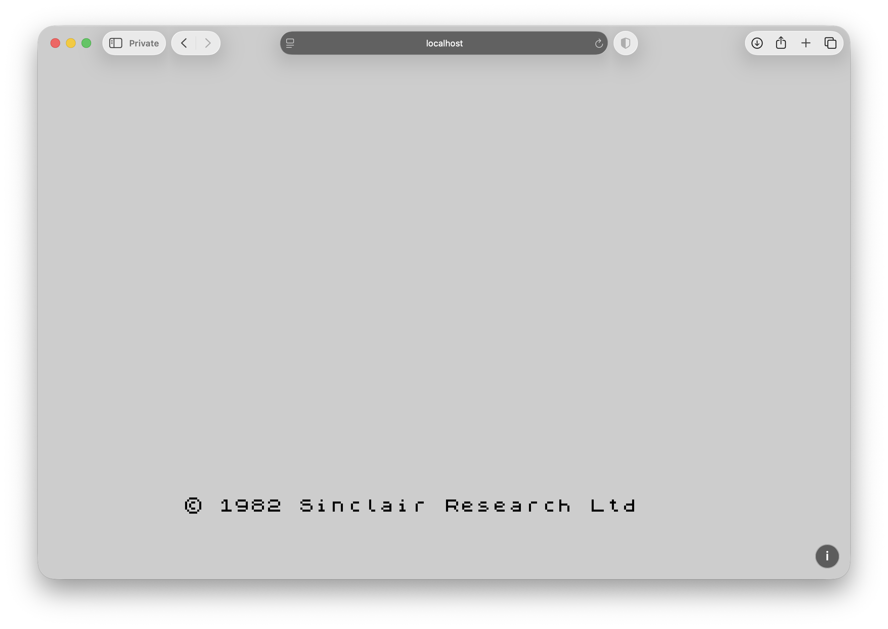
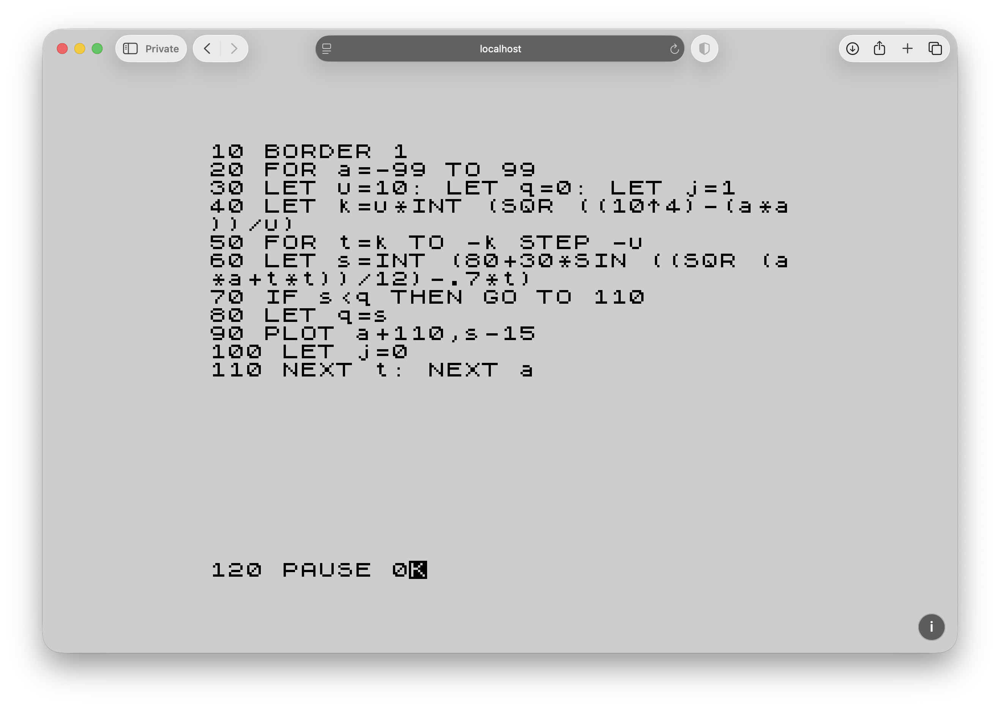
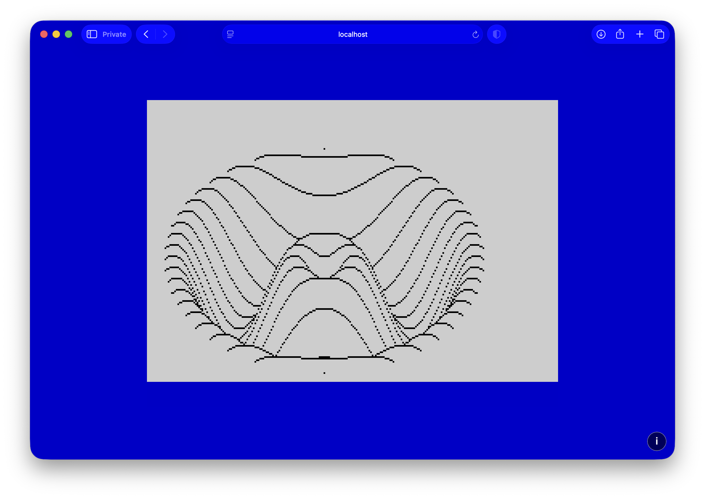

<p align="center"></p>

# zxbasic-rust

**A modern reimplementation of the 1982 ZX Spectrum BASIC interpreter, written in Rust, running natively in your browser via WebAssembly — built end-to-end as an AI software-engineering experiment.**

🟢 **Live:** <https://experiments.frontierslab.ai/zxspectrum>



---

## What this is

`zxbasic-rust` is a from-scratch reimplementation of the BASIC runtime that shipped on every Sinclair ZX Spectrum 48 K — the interpreter, the line editor, the calculator, the screen, the keyboard handler, the beeper, the lower-screen "0 OK" report, even the flashing inverse-`K` cursor. There is no Z80 CPU emulation, no instruction decoder, no bus, no cycle-stepped ULA, and none of the original ROM bytes are ever executed — in the taxonomy of emulator design this is **high-level emulation**: every behaviour the 1982 hardware exposed is **re-derived in idiomatic Rust** from reading the original Z80 source as a specification, and then compiled to native macOS / Windows / Linux binaries *and* a tiny WebAssembly module that boots a Spectrum-perfect screen inside any modern browser.

You can paste a program written for a real Spectrum and it just runs. The `©` glyph from the original character ROM. The exact bordcr colour pair the lower screen shifts into after `BORDER 2`. The K-mode cursor that pulses through the FLASH attribute bit at the same cadence as the real ULA. The `0 OK, 0:1` status line that appears the instant a program completes.

It is also, deliberately, **a controlled experiment in what current AI tooling can do**.

## Why this experiment matters

For decades, "port the BASIC ROM of a 1982 home computer to a modern stack" has been a textbook example of a project that demands a small team of specialists and a long calendar. You need someone who reads Z80, someone who understands the calculator's bytecode dispatch, someone who can reverse the screen attribute model, someone who can land it on multiple targets, and time — months of it — to align all of that with what real software actually does.

This repository was built in **a handful of hours**, by **a single experienced AI builder driving a bespoke workflow designed specifically to reconstruct architectures out of assembly-era source** — no human ROM expert in the room, no prior port to crib from. The 16 KB of commented Z80 served the same role a real hardware specification would: an authoritative reference for *what* the system does. The workflow handled the *how* — reading the source, re-deriving semantics in Rust, picking the architecture, writing the tests, debugging failures from screenshots, refactoring when the design stopped fitting, and ultimately producing a runtime that boots into a screen indistinguishable from a real Spectrum's.

That is the demonstration. The interesting thing isn't that "the AI wrote some code." The interesting thing is the *kind* of code:

* **Decoding undocumented legacy assembly.** Following 16 KB of hand-written Z80 across thirteen files of jumps, system variables, and self-referencing data tables. Recognising the calculator's tokenised bytecode is *not* Z80 instructions. Inferring that `bordcr` is a packed attribute byte and that `set_de` is the editor's cursor-positioning routine. Reading the ROM the way a domain expert would — without one in the room.
* **Re-implementing semantics across a 40-year language gap.** Translating side-effecty Z80 with shared system variables into an idiomatic Rust state machine with explicit ownership. Choosing where to mirror Spectrum quirks pixel-for-pixel (the `©` at character 0x7F, the `0 OK, 0:1` report format, the FLASH-attribute cursor pulse) and where modern abstractions are obviously better (the audio queue, the frame-driven scheduler that doesn't freeze the browser tab during an infinite loop).
* **Targeting platforms the original couldn't reach.** The same Rust core compiles to a native desktop binary and to WebAssembly. The browser frontend is 16 KB of unoptimised `.wasm`, draws straight to a `<canvas>` via `ImageData`, and synthesises the BEEP through WebAudio.

This is **work that genuinely was out of reach for an individual engineer at any reasonable cost**. With the right workflow, it isn't anymore — not in months of effort, not even in days. In hours.

That shift is bigger than any one project. It's the same kind of moment as the first time compilers replaced hand-written machine code, or the first time a high-level web framework replaced bespoke CGI. The threshold of "things one person can credibly ship" just moved, and it moved a long way. The bottleneck is no longer how many specialists you can hire — it's the workflow you bring.

This repository is a small, concrete data point on that curve.

## In action

A short BASIC program from the original Spectrum manual — the SIN-curve "apple" graphic — typed into the editor and then run:





`BORDER 1` paints the surrounding strip blue, `RUN` clears the upper screen and walks the nested FOR loops, every `PLOT` lands on the screen in real time, and `PAUSE 0` parks the runtime until you press a key — exactly the cadence of a real 1982 machine.

## What it does today

* Full Spectrum BASIC core: `LET`, `PRINT` (with `;` `,` `'` separators, `AT row,col`, `TAB n`), `INPUT`, `IF/THEN`, `GOTO`, `GOSUB/RETURN`, `STOP`, `FOR/NEXT/STEP`, `DEF FN / FN`, `DIM` (1‑D numeric), `DATA / READ / RESTORE`, `NEW`, `CLS`, `LIST`, `RUN`.
* Numeric and string values with the Spectrum suffix rule (`A$`).
* String slicing: `a$(n)`, `a$(n TO m)`, `a$(n TO)`, `a$(TO m)`, `a$(TO)`.
* Built-in functions: `SIN COS TAN ASN ACS ATN LN EXP INT ABS SQR SGN RND PI LEN CODE CHR$ STR$ VAL`.
* Comparisons returning 0/1 the Spectrum way.
* Graphics: `PLOT x,y`, `DRAW dx,dy`, `CIRCLE x,y,r`, with a Bresenham line and a midpoint circle.
* Colour: `INK`, `PAPER`, `BRIGHT`, `FLASH`, `BORDER`. Full 32×24 attribute file. Authentic 16‑colour Spectrum palette (8 normal + 8 BRIGHT). FLASH cells alternate ink/paper through a counter advanced by `frame()`.
* Audio: `BEEP duration, pitch` synthesised by WebAudio, with the Spectrum's blocking semantics (next statement waits for the tone to finish) and BREAK that actually cuts the playback.
* Editor: rows 22-23 are the lower screen, rendered in `bordcr` after a `BORDER` change. The K cursor only appears once the user starts typing — exactly as on a freshly powered-on Spectrum. Boot copyright reads `© 1982 Sinclair Research Ltd` and lives in the lower screen until cleared.
* `Esc` is BREAK (`Caps Shift + Space`). Interrupts a running program mid-statement, drains the audio queue, and posts the proper `L BREAK into program, <line>:1` report.
* Cmd/Ctrl+V paste pours a clipboard program into the editor as if you had typed every keystroke yourself, multi-line programs included.
* Reports follow `07_executive.asm:218`'s exact format — single-character code, message text, `, line:stmt`.
* Frame-driven `RUN`: programs execute in chunks aligned to the host's animation frames, so an infinite loop never freezes the tab and the screen redraws in real time as `PRINT` output appears.

## How it's built

Three Cargo crates plus a tools crate for one-shot data extraction:

```
crates/
├── zxbasic-core/      # platform-agnostic runtime: parser, executor, display model
├── zxbasic-web/       # wasm-bindgen façade — canvas, keyboard, audio glue
└── zxbasic-native/    # desktop harness (winit + softbuffer; minimal MVP-0 stub for now)
tools/                 # one-shot binaries that extract data tables from vendor/zxrom
vendor/zxrom/          # the original 1982 ROM in commented Z80 — submodule, spec-only
```

The `vendor/zxrom` submodule is the [`cheveron/zxrom`](https://github.com/cheveron/zxrom) repository — a faithful, well-commented disassembly of the original Sinclair Research ROM that compiles back to a byte-identical binary. We use it solely as a **specification**: the source comments and labels tell us what each routine is supposed to do, and we re-implement that meaning in Rust. The Z80 itself is never executed, and the binary the source produces (which remains the property of Sky/Comcast) is never built or shipped. Data tables that *are* reproduced — the 96‑glyph font, the keyword table, the error messages — are extracted by one-shot Rust programs in `tools/` and committed as plain Rust constants.

The runtime is a state machine over BASIC semantics — there is no Z80 CPU underneath. `System` owns everything: the BASIC program (a `BTreeMap<u16, String>` of stored lines), the variable table, the for-stack, the gosub-stack, the user-fn table, the array table, the audio queue, the program counter, the BREAK flag, the BEEP-blocking frame countdown, the editor input line, and the lower-screen status. The host (browser or native window) calls `feed_key`, `frame`, and `render_into` — that's the entire API. Everything else, including the JS-side audio scheduling and the canvas paint, is a thin glue layer.

## Running it locally

```
# Clone with the ROM disassembly submodule:
git clone --recursive https://github.com/ashtree74/zxbasic-rust.git
cd zxbasic-rust

# Web build (requires rustup + wasm-pack):
wasm-pack build crates/zxbasic-web --target web --out-dir ../../web/pkg
python3 -m http.server 8765 -d web
# open http://localhost:8765/index.html

# Run the full test suite:
cargo test -p zxbasic-core
```

## Deploying to a VPS

The whole runtime is a static site once the WebAssembly bundle has
been built: an HTML file, a JS shim, and a `.wasm` binary, all under
`web/`. Any HTTP server that can serve a directory works. On a Linux
VPS the smallest reasonable setup is:

```bash
# One-time install of the Rust toolchain (skip if already present):
curl --proto '=https' --tlsv1.2 -sSf https://sh.rustup.rs | sh -s -- -y
. "$HOME/.cargo/env"
rustup target add wasm32-unknown-unknown
cargo install wasm-pack

# Clone the repo somewhere persistent on the VPS:
sudo mkdir -p /opt && cd /opt
sudo git clone --recursive https://github.com/ashtree74/zxbasic-rust.git
cd zxbasic-rust

# Build the WebAssembly bundle into web/pkg:
wasm-pack build crates/zxbasic-web --target web --out-dir ../../web/pkg
```

Then point your existing web server at `/opt/zxbasic-rust/web/`.

For the canonical deployment at `experiments.frontierslab.ai/zxspectrum`,
nginx looks roughly like:

```nginx
location /zxspectrum/ {
    alias /opt/zxbasic-rust/web/;
    try_files $uri $uri/ /zxspectrum/index.html;
}
```

Apache:

```apache
Alias /zxspectrum /opt/zxbasic-rust/web
<Directory /opt/zxbasic-rust/web>
    Require all granted
</Directory>
```

To update to the latest commit:

```bash
cd /opt/zxbasic-rust
git pull --recurse-submodules
wasm-pack build crates/zxbasic-web --target web --out-dir ../../web/pkg
```

That's it — no rsync, no CI secrets, no third-party hosting. Wire
`git pull` into a cron job or a webhook handler if you want it
automated.

## Roadmap

Already in: everything listed under "What it does today."

Reasonable next steps (none required for the demo to be useful):

* `AND` / `OR` / `NOT` operators in expressions.
* `SAVE` / `LOAD` of programs to / from `localStorage`.
* Multi-dimensional arrays; string arrays.
* `INVERSE`, `OVER`, `BRIGHT n`, `FLASH n` as inline PRINT modifiers.
* A full K/L/C/E/G mode editor with single-keystroke keyword entry — the most authentic touch left to add. This pulls in the rest of `02_keyboard.asm`'s token table and editor mode tables.
* Optional Z80 emulator backplane to let real `.tap` games run — explicit non-goal of the BASIC project, but trivially layerable on top once someone wants it.

## Credits & contact

Built by **[Adam Jesionkiewicz](mailto:adam@jesion.pl)** at **[Frontiers Lab](https://frontierslab.ai)**, an applied AI lab exploring what current AI tooling makes newly feasible.

* Email: adam@jesion.pl
* Live demo: <https://experiments.frontierslab.ai/zxspectrum>

The ZX Spectrum is © Sky/Comcast (formerly Sinclair Research Ltd, 1982). This project reimplements the *semantics* of the system's BASIC interpreter from a Creative Commons-licensed source disassembly and ships no binary derived from the original ROM. The character font is reproduced under the source disassembly's CC BY-SA 4.0 terms.

The Z80 source used as a specification is [`cheveron/zxrom`](https://github.com/cheveron/zxrom), © 2011 Source Solutions, Inc., released under CC BY-SA 4.0 — the source files are public for historical and educational use; the binary they produce is not. We respect that boundary.

## Inspirations & borrowings

The CRT shader pipeline borrows from two public-domain Godot shaders by Harrison Allen — "CRT with luminance preservation" and the "no scanlines" variant — for the radial barrel warp, the sRGB-linear mask math, the three-tap subpixel reconstruction with per-channel beam offsets, and the catalogue of phosphor patterns (Dots, Aperture, Wide, Wide Soft, Slot). The screen-rect layout, the BORDER stripe rendering, the rounded bezel, the master toggle, and the settings UI on top are ours.

The wider analog-CRT feel — burn-in phosphor trail, static noise, screen flicker, jitter, horizontal-sync wobble, ambient halation, the curated monochrome phosphor profiles (Amber, Green, Apple ][, IBM CGA, Vintage), and the rasterization-pattern picker — is modelled on Swordfish90's cool-retro-term, the QML/GLSL terminal that set the bar for this look. Our implementation is a from-scratch WebGL2 port of those ideas; nothing is copied verbatim.

## License

The Rust source in this repository is dual MIT / Apache‑2.0. Data tables extracted from `vendor/zxrom` (the 96‑glyph font, eventually the keyword and key‑map tables) inherit the upstream CC BY‑SA 4.0 licence.
